# kabu-maker-taker 全量交易代码审计报告

审计日期：2026-05-17
审计基线：`main`，最新提交 `31b324a fix: cancel loop snapshot, scale-in lollipop state, microprice_gap_ticks`
工作区状态：`main...origin/main`，仅有未跟踪 `kabu_STATION_API.yaml`，未纳入审计交付和提交范围。
测试基线：`python -m unittest discover -s tests -p "test_*.py"`，308 tests OK。

## 1. 总体结论

总分：75/100
风险等级：中高风险，偏工程验证阶段
是否建议仿真：可以进入受控离线回放和 dry-run 仿真，但结果不能直接外推到真实 maker/HFT 收益。
是否建议小资金实盘：不建议。当前 live 仍是受控 REST + fresh JSONL validation 路径，仓库明确没有完整 WebSocket 行情循环或无人值守 live runtime。
是否需要重构：不需要全量重构；需要围绕 live runtime、行情适配、回测真实性和实盘监控做定向升级。

当前代码比上一轮红线状态明显更安全：`--live` 已有严格 safety config validator，`--live --events` 会用 wall-clock 校验新鲜度；持仓只在 broker order/fill event 后更新；动态 sizing 后会再过 notional cap；force-exit 被 active exit 阻挡时已有 deferred 处理；REJECTED+TIMEOUT force-exit 可重新发起。

但从实盘安全角度，仍存在红线：缺少生产级实时行情 adapter、断线重连、序列恢复、无人值守 live loop 和实盘环境延迟/撮合保证证据。券商费用、交易所规则、真实撮合保证、真实队列位置、生产网络延迟均为 `譌豕募愛譁ｭ`。

## 2. 逐项评分

| 检查项 | 分数 | 结论 |
| --- | ---: | --- |
| 项目结构清晰度 | 8/10 | `app`、strategy、risk、orders、execution、simulator、replay、telemetry 分层清楚；仍缺生产 live adapter 层。 |
| 业务逻辑完整度 | 8/10 | dry-run/live validation 交易生命周期基本闭环；live 不是连续实时系统。 |
| 策略逻辑合理性 | 7/10 | OBI、LOB OFI、tape、microprice、breakout、lollipop exit 较完整；缺实证校准和部分行情异常防御。 |
| 风控完整性 | 12/15 | session、daily loss、rate limit、stale、API/latency circuit、notional cap 已有；真实 broker 侧硬约束仍不足。 |
| 下单与订单管理 | 12/15 | 订单账本、partial fill、dedup、cancel、REJECTED/UNKNOWN 路径较完整；live 仍依赖 REST polling。 |
| 行情数据可靠性 | 7/10 | board valid/stale/out-of-order 有处理；缺 WebSocket 重连、序列号、auction/trading halt 状态。 |
| 回测真实性 | 6/10 | simulator 已有 IOC、L2 sweep、maker queue 模型；缺真实延迟、撮合优先级、费用和冲击建模。 |
| 性能表现 | 7/10 | 纯 Python 热路径较轻；同步 REST、逐 tick flush 日志和缺少压测是 live/HFT 风险。 |
| 日志与监控 | 4/5 | decision trace、journal、metrics 覆盖较好；缺告警、健康检查和外部监控。 |
| 异常处理 | 4/5 | API/latency circuit、kill switch、emergency flatten 已有；无人值守恢复能力不足。 |

## 3. Top 5 优先修复项

| 优先级 | 问题 | 风险 | 修复建议 |
| --- | --- | --- | --- |
| P0 | 没有生产级 WebSocket 行情循环、断线重连、序列恢复和 unattended live runtime | 无法证明 live 行情连续性；断线或卡顿时可能继续基于错误状态交易 | 新增 live market-data adapter，包含订阅、heartbeat、重连、快照重同步、序列/时间戳校验和停机策略。 |
| P1 | `TradePrint.from_dict()` 将缺失或 0 `side` 归为 -1 | 缺失方向的成交会被当成卖压，污染 tape OFI 和 taker/maker 信号 | side 缺失/0 时拒绝 trade event 或标记 unknown，不进入 tape OFI；增加测试。 |
| P1 | 回测 fill model 仍无法证明真实队列位置、延迟、隐藏流动性、费用和市场冲击 | 仿真收益可能显著高估，尤其 maker 策略容易被 queue/fill bias 放大 | 加入 latency model、费用/税费默认、安全滑点、queue priority 参数和真实成交回放校准。 |
| P1 | live 要求 decision trace/journal，但日志逐 tick/逐行 flush | 高 tick 频下可能放大 live loop latency，并触发或掩盖 latency circuit | 改为可控批量 flush、异步 writer 或 bounded queue；保留崩溃前强制 flush。 |
| P2 | `auto_fix_negative_spread` 默认自动交换 bid/ask | 可能掩盖行情字段映射错误或交易所异常状态，live 中应更保守 | live 下负 spread 默认拒绝并 halt/abnormal，只有明确配置才允许自动修正。 |

## 4. 实际交易生命周期

```mermaid
flowchart LR
    A["JSONL/sample/live validation event"] --> B["BoardSnapshot / TradePrint parsing"]
    B --> C["MicrostructureSignalEngine"]
    C --> D["TakerStrategy first, MakerStrategy fallback"]
    D --> E["ConfirmationTracker"]
    E --> F["RiskManager.can_enter + order_qty"]
    F --> G["OrderIntent tracked in OrderLedger"]
    G --> H["DryRunSimulator or KabuRestExecutor"]
    H --> I["BrokerOrderEvent / BrokerFillEvent"]
    I --> J["OrderLedger applies status/fill delta"]
    J --> K["Combined strategy updates Position/PnL"]
    K --> L["Lollipop exit / journal / metrics / decision trace"]
```

关键证据：
- `app.py` 在 live 前校验 `dry_run=false`、禁止 `--sample`、禁止 broker snapshot 混用，并调用 `_validate_live_config()` 和 `_validate_live_events_file()`。
- `app.py` live loop 使用 `time.time_ns()` 作为 live `now_ns`，不再用历史 `snapshot.ts_ns` 冒充当前时间。
- `combined.py` 的 `apply_fill()` 被禁用，持仓只通过 `on_broker_order_event()` / `on_broker_fill()` 后的 fill delta 更新。
- `risk.py` 的 `order_qty()` 和 `can_enter()` 已按最终 order qty 和 expected price 做 notional 防御。
- `orders.py` 将订单状态、broker id、cum qty、partial fill 和 trade id dedup 放在独立账本中。

## 5. 项目结构评价

项目结构清晰，核心模块职责边界合理：
- `combined.py` 是策略协调器，不直接接触 live API。
- `risk.py` 是最终 entry gate。
- `orders.py` 是订单账本，避免成交前直接改持仓。
- `execution/` 封装 kabu REST client/executor/parser。
- `simulator.py` 和 `replay.py` 提供 dry-run 与离线回放。
- `telemetry.py` / `journal.py` / `metrics.py` 覆盖决策、交易和指标。

不足是 live runtime 仍散落在 `app.py` + `live_runtime.py` 的事件驱动 CLI 中，缺少独立的生产 live service 边界：行情 adapter、order callback adapter、reconnect manager、clock/sequence validator、health monitor 尚未成型。

## 6. 策略逻辑专项评价

优点：
- `MicrostructureSignalEngine` 覆盖 weighted book imbalance、LOB OFI、tape pressure、microprice、rolling z-score、wall consumption、cancel imbalance、breakout、vol expansion。
- `TakerStrategy` 要求 primary checks、score threshold、execution quality、breakout/price breakout，且 taker 优先于 maker。
- `MakerStrategy` 支持 fair value、reservation price、inventory skew、quote drift、queue retreat、urgent cancel。
- `LollipopTPManager` 将 maker/taker entry 后的 TP、timeout、stop-loss、force-exit 做成状态机。

主要风险：
- 策略阈值缺少真实样本校准证据，收益假设仍是 `譌豕募愛譁ｭ`。
- `TradePrint.from_dict()` 对缺失/0 side 的处理过于激进，会制造假卖压。
- 真实盘口状态如 auction、halt、special quote、price limit、板寄せ等没有明确状态输入，`MarketStateDetector` 只能基于 spread/event rate/jump 做近似判断。

## 7. 风控专项评价

已具备的关键风控：
- spread、invalid quote、stale quote、stale board、session、inventory、notional、daily loss、consecutive loss cooling。
- entry rate limit、cancel rate limit、API circuit、latency circuit、soft/hard kill switch。
- live 启动要求 safety profile 完整：journal、decision trace、market state、session、daily loss、rate limit、stale guards、API/latency circuits。
- emergency flatten 会尝试取消本地 active orders、扫描 broker open orders，再按 broker position 发 force close。

不足：
- 风控是进程内控制；没有 broker-side OCO/最大亏损/最大持仓硬风控证据。
- 费用和滑点默认值在示例配置中为 0，真实成本为 `譌豕募愛譁ｭ`。
- live 仍缺完整行情/订单双通道状态恢复，API 成功但订单状态延迟可见时的真实行为仍需 broker 环境验证。

## 8. 订单与成交回报专项评价

安全点：
- `OrderLedger` 会维护 active/final 状态、broker id 映射、cum qty、avg price、final history 和 fill id dedup。
- partial fill 后只按增量更新持仓，full close 后才记录完整 trade close。
- active exit 遇到 force-exit 会先发 `exit_cancel_signal`，取消后再释放 deferred force-exit。
- REJECTED exit 在 TIMEOUT 下会 reset force-exit flag，下一 tick 可重新发起。

风险点：
- live order events 依赖 REST polling，不是 broker push callback；poll 延迟、漏单、成交明细顺序保证为 `譌豕募愛譁ｭ`。
- UNKNOWN submit/cancel 虽会 halt 并 emergency flatten，但真实 broker 是否已接单、open orders 何时可见仍需实盘沙盒验证。
- direct `BrokerFillEvent` 空 `trade_id` 不 dedup 是兼容设计；如果未来 live adapter 绕过 parser，应强制生成稳定 fill id。

## 9. 行情数据专项评价

已覆盖：
- `BoardSnapshot.valid` 要求 bid/ask 正数、ask>=bid、size 非负。
- duplicate/out-of-order board 会被 `combined.py` 拦截。
- live events 必须有 fresh `ts_ns`，且 stale/future 都会拒绝。
- stale board gap 可阻断 entry 并触发 urgent cancel。

缺口：
- 没有生产 WebSocket adapter、heartbeat、sequence number、snapshot resync。
- `auto_fix_negative_spread=true` 默认会自动交换 bid/ask，live 下容易掩盖数据源字段错误。
- trade side 缺失时被当作卖方成交，是明确数据污染风险。
- 交易所状态、涨跌停、特别气配、停牌、午休边界等规则均为 `譌豕募愛譁ｭ`。

## 10. 回放与仿真专项评价

仿真可以用于工程验证，不能直接用于实盘收益判断。

优点：
- taker market intent 在 simulator 中按 IOC 语义扫 L2 depth，并取消未成交部分。
- maker limit fill 需要 trade print 消耗队列，而不是简单看到价格穿越就成交。
- replay 已补齐 exit cancel/deferred force-exit，与 app dry-run 主循环更一致。
- evolution 支持 grid search 与 walk-forward 形态。

缺口：
- 初始 queue ahead 使用提交时 L1 size，无法证明真实队列位置。
- 没有 order acknowledgement delay、cancel delay、feed delay、REST jitter、交易所撮合延迟。
- 默认费用/滑点为 0，不符合真实交易成本。
- 没有真实成交/订单簿 replay 校准报告，walk-forward 选择逻辑仍容易过拟合。

## 11. 性能专项评价

优点：
- 核心数据结构多用 slots，signals 中 rolling window 多为 deque/O(1) 更新。
- REST client 分 order/poll lane token bucket，避免简单无限打 API。
- latency circuit 记录 submit/cancel/poll 三类 REST 延迟。

风险：
- 当前 live path 是同步 REST + sleep + polling，不能满足严格 HFT 延迟模型。
- live safety 要求 decision trace 和 journal，但 trace 每 tick 写入并 flush，可能放大尾延迟。
- 未看到系统性 microbenchmark、长时压测、GC/IO 抖动统计。

## 12. 日志与监控专项评价

已具备：
- `DecisionTraceWriter` 记录 entry/exit intent、cancel signal、blocked reason、market state、position avg/mode 等字段。
- `TradeJournal` 记录 full close 和 markout。
- `MetricsCollector` 输出 entry/fill/cancel/risk block/latency/PnL/markout 指标。
- live halt 会输出 orders snapshot、metrics 和 cleanup。

缺口：
- 缺少外部告警、进程健康检查、heartbeat、日志轮转策略。
- emergency flatten cleanup 结果仅打印，未见持久化告警或人工确认流程。
- 高频日志 flush 可能影响性能，需改为 bounded async 或 batch。

## 13. 异常处理专项评价

已覆盖：
- live startup 失败返回 `live_start_failed`。
- submit/cancel/poll API error 会生成 UNKNOWN/halting 路径并触发 API circuit。
- latency 连续超限会触发 latency circuit。
- hard kill switch 会进入 emergency flatten。
- local invalid IOC intent 会变成本地 REJECTED，不直接抛到主循环外。

仍需补强：
- 无完整 unattended recovery 设计；halt 后依赖人工查看输出。
- 没有 token 过期自动刷新、WebSocket reconnect、行情快照重同步。
- JSONL parsing 异常、配置字段非法等仍会直接终止，适合验证工具，不适合无人值守 live。

## 14. 测试覆盖判断

已覆盖的关键安全路径：
- live 启动安全门、API password、dry_run=false、API circuit、fresh/stale/future/missing live event timestamp。
- notional cap 对最终 qty 生效，动态 sizing 不能越过 max_notional。
- API circuit、latency circuit、entry rate limit、cancel rate limit、stale board、kill switch。
- partial fill、partial exit PnL、daily loss、fill dedup、cancel/fill 顺序。
- broker reconciliation、active order startup guard、force-exit deferred、REJECTED+TIMEOUT retry、zero bid stop-loss guard。
- telemetry/journal 字段与 exit reason。

缺失测试：
- 缺失/0 trade side 不应污染 tape OFI。
- live negative spread 默认拒绝而不是自动修正。
- token 过期、kabu Station 重启、网络半开、订单已接收但 response 丢失。
- broker fill details 重排、重复、缺 ExecutionID 的更复杂场景。
- 高 tick 率下 decision trace/journal flush 的延迟压测。
- 真实交易日多文件 walk-forward、手续费/滑点敏感性和 queue model 校准。

## 15. 红线章节

当前代码不建议小资金实盘，原因如下：
- README 明确写明“不提供完整 WebSocket market-data loop 或 unattended live-trading runtime”。
- `app.py` 的 live path 仍围绕 `--events` 迭代，虽然已要求 fresh wall-clock timestamp，但这不是生产实时行情订阅系统。
- 没有看到行情断线重连、序列恢复、快照重同步、token 自动刷新、健康检查和外部告警。
- 真实 broker 费用、交易所限制、撮合保证、订单回报时序和生产延迟为 `譌豕募愛譁ｭ`。

因此：可以继续做 dry-run、离线 replay、受控 live validation；不建议无人值守实盘，也不建议小资金实盘。

## 16. 修复建议

1. 先实现 production live runtime：WebSocket 行情、REST/order callback 协调、heartbeat、reconnect、snapshot resync、sequence/time validator。
2. 修复 trade side 输入校验：unknown side 不进入 tape OFI，记录 telemetry，并增加 live/replay 测试。
3. live 下禁用默认 negative spread auto-fix，改为 reject/abnormal/halt，除非显式启用兼容模式。
4. 将 decision trace/journal 改成 bounded async/batch writer，并加入高频压测。
5. 提升 simulator：费用默认非 0、延迟分布、cancel latency、queue priority、market impact、真实成交回放校准。
6. 增加 broker failure matrix 测试：submit response lost、cancel unknown、poll stale、token expiry、kabu restart、mixed exchange close。

## 17. 最终建议

短期建议：继续仿真和 controlled dry-run，重点验证策略边际、订单事件顺序和风险门。
中期建议：先补 live runtime 和行情适配，再考虑极小资金人工盯盘验证。
当前实盘结论：不建议实盘。
